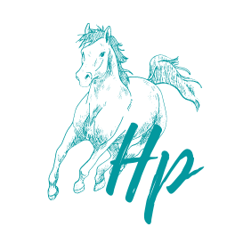

# Agaba Derrick Junior - Portfolio Website

This is the repository for Agaba Derrick Junior's portfolio website. It showcases Agaba's skills, projects, and contact information. This README provides an overview of the project structure and how to navigate the codebase.

## Table of Contents
- [Introduction](#introduction)
- [Features](#features)
- [Getting Started](#getting-started)
- [Usage](#usage)
- [Contributing](#contributing)
- [License](#license)

## Introduction
This website serves as Agaba Derrick Junior's digital portfolio. It includes sections about his background, skills, projects, and how to get in touch with him. The website is designed to highlight Agaba's capabilities as a mid-level Software Engineer.

## Features
- **Dynamic Name Display**: The website dynamically displays Agaba's name, cycling through different names.
- **Interactive Design**: It features a responsive and visually appealing design.
- **Project Showcase**: Agaba's portfolio includes a section for showcasing his projects, complete with project descriptions and mentor information.
- **Contact Form**: The "Get In Touch" section provides a contact link to reach Agaba for business inquiries.
- **Footer Links**: The footer includes links to Agaba's CV, portfolio, LinkedIn, and GitHub profiles.

### Future Features (Expected)
- **Blog Section**: Agaba may add a blog section to share insights and knowledge.
- **Client Testimonials**: Displaying testimonials from satisfied clients.
- **Improved Project Details**: Expanding project descriptions and adding more projects.

## Getting Started
To run this website locally or deploy it, follow these steps:

1. Clone this repository.
2. Open the `index.html` file in your web browser.

## Usage
- Explore Agaba's portfolio and learn about his skills and projects.
- Contact Agaba for potential business collaborations.
- Feel free to adapt this code for your own portfolio or personal website.

## Contributing
Contributions are welcome! If you'd like to improve the website or suggest new features, please open an issue or submit a pull request. 

## License
This project is licensed under the MIT License - see the [LICENSE](LICENSE) file for details.
